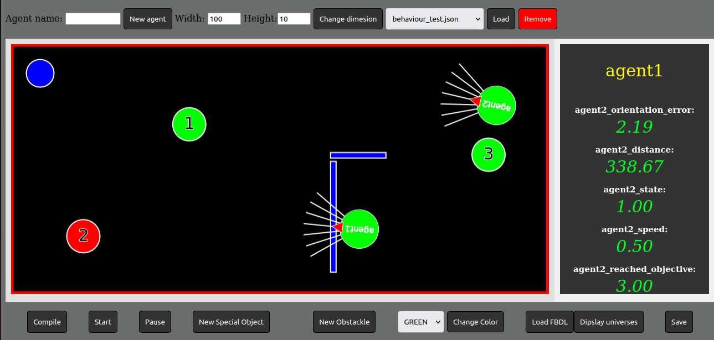

# Fuzzy Behavior Description Language simulator for creating an testing complex behaviors
One possible way to describe complex behaviours for robots is to use a fuzzy rule based system. The Fuzzy Behaviour Description Language (FBDL) is a language designed to be used for describing complex behaviour sets by language terms, which are close natural language terms. In order to enable the system to make decisions in those cases which are not covered by appropriate fuzzy rules in a given fuzzy control system, suitable Fuzzy Rule Interpolation (FRI) methods can be applied. The current FBDL engine incorporates the FIVE (Fuzzy Interpolation in Vague Environment) FRI method, therefore allowing the definition of behaviours by only specifying the most significant rules, which can be even performed by a human expert. In this paper, we propose an agent based simulator, which was designed for the preliminary observation and fine-tuning of the behaviours described with FBDL. It is also possible to modify these behaviours during runtime, and monitor their internal states in real-time. The presented simulator was implemented as a Robot Operating System (ROS) component, hence enabling the FBDL agents to control real robots as well.
### Conference paper
- [ICCC 2024](https://www.researchgate.net/publication/381908054_An_Agent_Based_Simulator_on_ROS_for_Fuzzy_Behavior_Description_Language_FBDL)
  
### Other projects in this topic:
- [exprail-python](https://github.com/piller-imre/exprail-python)
- [fribe-python](https://github.com/piller-imre/fribe-python)

# Installation steps
## Required Environment:
- ROS 2 Humble/Foxy
- ROS Bridge Server (`sudo apt install ros-humble-rosbridge-server`)
- NodeJS

## Installation:

1. Create a ROS workspace and clone this repository into the `src` directory.
2. Navigate to the `web_ros2` directory and run the command `npm install`.
3. Navigate to the workspace directory and run the command `colcon build`.
4. Use the command `source install/setup.bash`.
5. Start the background system with the command `ros2 launch ros2_fuzzy simulation_controller`.
6. Navigate to the `src/web_ros2/src` directory and start the web interface with the command `node server.js`.
7. Access the simulator in your browser at `localhost:3000`.

# Simulator Controls

- **Compile**: Loads the behavioral pattern designed in the rule editor onto the selected agent.
- **Start**: Starts the simulation.
- **Stop**: Pauses the simulation.
- **New Special Object**: Adds a numbered circular object. After clicking the button, click on the point in the simulation where you want to place the object.
- **New Obstacle**: Similar to the special object, a new obstacle can be added by clicking the button and selecting a point in the simulation.
- **Stop Adding**: This button is hidden by default. It allows continuous creation of new obstacles by clicking, and the button stops this process.
- **Change Color**: Changes the color of the selected obstacle or special object. Select the object, click the button, and choose a new color from the list.
- **Load FBDL**: Loads the FBDL behavioral pattern of the selected agent into the rule editor.
- **Display Universes**: Displays the universes and rule bases used for editing the behavioral pattern.
- **Save**: Saves the current state of the simulation. The system will prompt you for a name and location to save the state. It is important to save it to the `~/web_ros2/src/public/maps` folder; otherwise, the server won't be able to load it later.
- **New Agent**: Creates a new agent with the name specified in the text field next to the button.
- **Change Dimension**: Changes the width and height of the selected obstacle object based on the numeric values in the Width and Height fields.
- **Load**: After pressing the **Stop** button, previously saved simulation states will appear in the list next to the button. The selected state can be loaded by pressing **Load**.
- **Remove**: Allows the deletion of any object in the simulation environment by selecting it and pressing the **Remove** button.
  
